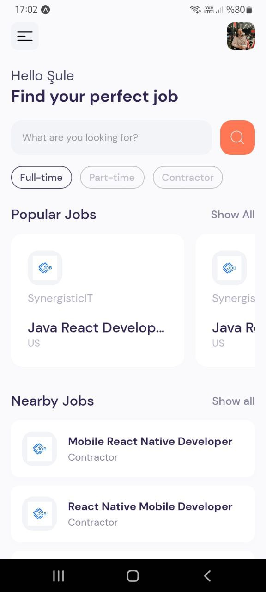
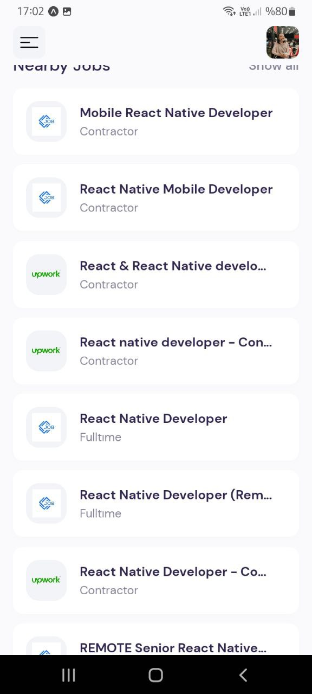

# Find Your Job App  
I learned some basic components in this repo. These: <br/>

📍 **TouchableOpacity:** button or interactive elements <br/>
📍 **ActivityIndicator:** spinner or loading indicator <br/>
📍 **FlatList:** a long list of items, like the map function in React <br/>
it has extra feaures: optimized scroll performance & item separation <br/>
for larger lists with smooth scrolling -> FlatList <br/>
for smaller lists -> Map function <br/>
📍 **ScrollView:**  multiple components and views, providing scrolling container for them  <br/>
📍 **SafeAreaView:** It provides a safe zone to render your app's content without being covered by the device's hardware features like the notch, home indicator, or status bar <br/>
<br/>
I used **JSearch API** by OpenWeb Ninja. Here: https://rapidapi.com/letscrape-6bRBa3QguO5/api/jsearch

 ### Images
     


### How to use 🚀
<br/>

```sh
npx create-react-native-app -t with-router
```

<br/>
For more information: https://expo.github.io/router
